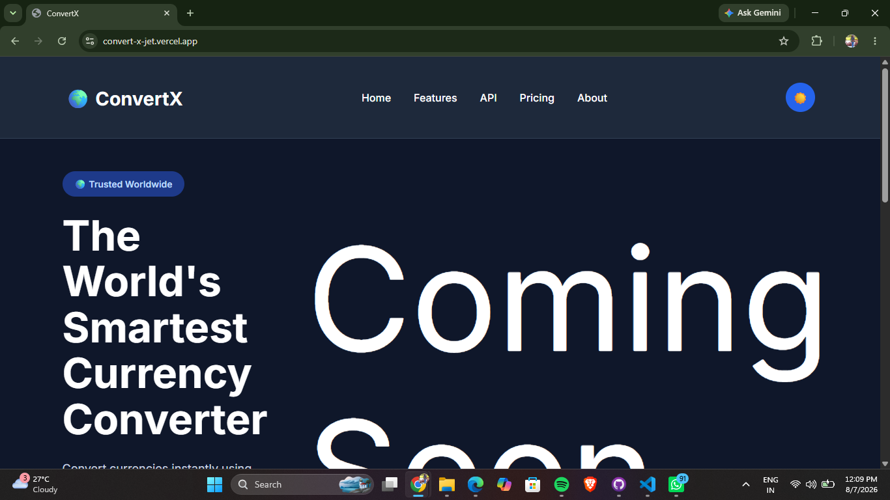
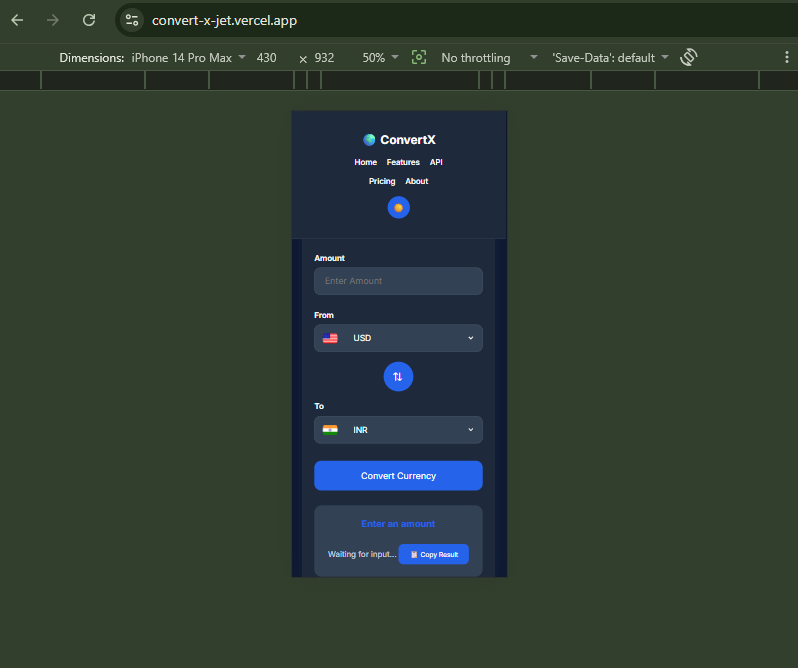

# 🌍 ConvertX

<p align="center">

Modern Currency Converter & Travel Finance Toolkit built using **HTML, CSS & JavaScript**.

</p>

<p align="center">


</p>

---

# 🚀 Live Demo

👉 **https://convert-x-jet.vercel.app**

---

# 📷 Project Preview

## 🖥 Desktop



---

## 📱 Mobile



---

# ✨ Features

- 🌍 170+ Supported Currencies
- 💹 Live Exchange Rates
- 🚩 Country Flags
- 🔄 One Click Currency Swap
- 📋 Copy Conversion Result
- 🌙 Dark / Light Theme
- 📱 Fully Responsive Design
- ⚡ Fast & Lightweight
- 🔄 Auto Update on Currency Change
- 🎯 Clean & Modern UI

---

# 🛠 Tech Stack

- HTML5
- CSS3
- JavaScript (ES6)
- Currency API
- Flags API

---

# 📂 Folder Structure

```text
ConvertX
│
├── assets
│
├── CSS
│   ├── style.css
│   ├── hero.css
│   ├── navbar.css
│   ├── converter.css
│   ├── footer.css
│   └── responsive.css
│
├── js
│
├── screenshots
│
├── index.html
└── README.md
```

---

# 🎯 Future Improvements

- 📊 Exchange Rate Charts
- ⭐ Favorite Currencies
- 📜 Conversion History
- 🌐 Offline Support
- 📱 Progressive Web App (PWA)
- 💱 Multi Currency Comparison

---

# 👩‍💻 Author

**Prerna Pandey**

### GitHub

https://github.com/Prerna-pandey23

### LinkedIn

https://www.linkedin.com/in/prerna-pandey-001a29294

---

# ⭐ Show your Support

If you found this project useful,

⭐ **Please Star this Repository**

It motivates me to build more awesome projects.

---

<p align="center">

Made with ❤️ by Prerna Pandey

</p>